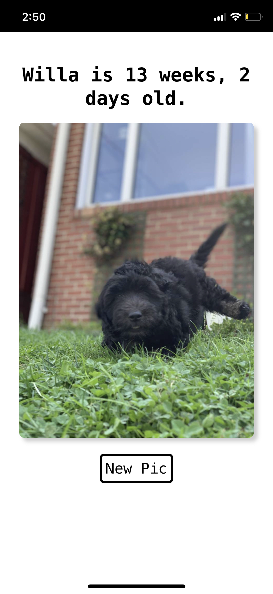

# willa

<!-- badges: start -->
<!-- badges: end -->

First, I built a {shiny} app to remind me how old Willa is. Being complete overkill, I learned how to build the same app using only HTML, CSS, and javascript and how to add progressive web app functionality. Yes, I need to charge my battery. 

